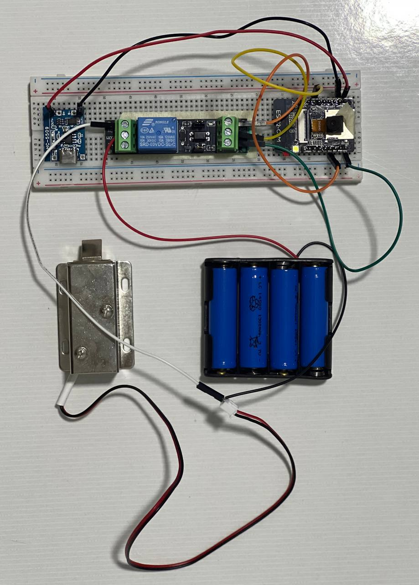

# IntelliKey - AI-Powered ESP32-CAM Access Control System

🔐 **Smart Face Recognition Door Access Control System** built with ESP32-CAM for the IntelliKey AI Hackathon


## 🌟 Features

- **🤖 AI Face Recognition**: Real-time face detection and recognition using ESP32's built-in AI capabilities
- **🌐 Web Interface**: Modern responsive web interface with real-time camera streaming
- **🔒 Access Control**: Automatic door unlocking for recognized faces
- **👥 User Management**: Enroll, manage, and delete user faces through web interface
- **🔐 Authentication**: Secure login system with username/password protection
- **📱 Real-time Streaming**: Live camera feed with WebSocket communication
- **💾 Flash Storage**: Persistent face data storage in ESP32 flash memory
- **⚡ Fast Response**: Quick face recognition with configurable detection thresholds

## 🛠️ Hardware Requirements

### Essential Components
- **ESP32-CAM (AI-Thinker)** - Main controller with camera
- **Relay Module** - For door lock control
- **Door Lock** - Electric strike/magnetic lock
- **Power Supply** - 5V/2A minimum
- **MicroSD Card** (optional) - For additional storage

### Recommended Setup
- **ESP32-CAM Development Board**
- **FTDI USB to TTL Converter** - For programming
- **Jumper Wires**
- **Breadboard or PCB**
- **3.3V/5V Relay Module**

### 📷 Hardware Setup Reference

*Complete hardware setup showing ESP32-CAM, relay module, and connections*

## 📋 Prerequisites

### Software Requirements
- **Arduino IDE** (v1.8.x or v2.x)
- **ESP32 Arduino Core v1.0.6** (⚠️ **Important**: v2.x doesn't support face recognition)
- **ArduinoWebsockets Library** (v0.5.4+)

### Library Installation
```bash
# Install required libraries through Arduino IDE Library Manager:
# 1. ArduinoWebsockets by Gil Maimon
# 2. ESP32 Arduino Core v1.0.6 (NOT v2.x)
```

## 🚀 Quick Setup Guide

### Step 1: Hardware Connections

#### 📋 Circuit Diagram


#### 📸 Physical Setup Example


#### ESP32-CAM Connections
```
ESP32-CAM Pin  ->  Connection
=================================
5V            ->  5V Power Supply
GND           ->  Ground
GPIO 2        ->  Relay Control Pin
GPIO 0        ->  GND (for programming)
U0T           ->  FTDI RX
U0R           ->  FTDI TX
```

#### Relay Connections
```
Relay Pin     ->  Connection
=================================
VCC           ->  5V
GND           ->  Ground  
IN            ->  ESP32-CAM GPIO 2
NO/NC         ->  Door Lock Power
```

#### 🔌 Wiring Details
- **Power Supply**: Use a stable 5V/2A power adapter
- **Relay Module**: Connect to GPIO 2 for door control
- **Programming**: Connect GPIO 0 to GND only during code upload
- **Door Lock**: Connect through relay's NO (Normally Open) contacts

### Step 2: Arduino IDE Setup

#### Install ESP32 Board Package
1. Open Arduino IDE
2. Go to **File → Preferences**
3. Add ESP32 board manager URL:
   ```
   https://raw.githubusercontent.com/espressif/arduino-esp32/gh-pages/package_esp32_index.json
   ```
4. Go to **Tools → Board → Boards Manager**
5. Search "ESP32" and install **version 1.0.6** (⚠️ NOT 2.x)

#### Board Settings
```
Board: "AI Thinker ESP32-CAM"
Upload Speed: "115200"
Flash Frequency: "80MHz"
Flash Mode: "QIO"
Partition Scheme: "Huge APP (3MB No OTA/1MB SPIFFS)"
Core Debug Level: "None"
```

### Step 3: Project Setup

#### Download and Install
1. Clone or download this repository
2. Open `IntelliKey_ESP32CAM_AccessControl.ino` in Arduino IDE
3. Install required libraries:
   - ArduinoWebsockets (v0.5.4+)

#### Configuration
Edit the following in the main `.ino` file:

```cpp
// WiFi Configuration
const char *ssid = "Your_WiFi_Network";
const char *password = "Your_WiFi_Password";

// Login Credentials  
const char *username = "admin";
const char *loginPwd = "your_secure_password";

// Hardware Configuration
#define relay_pin 2  // GPIO pin connected to relay
```

### Step 4: Upload and Test

#### Programming Mode
1. Connect **GPIO 0** to **GND**
2. Connect FTDI adapter
3. Press **Reset** button
4. Upload code
5. Disconnect **GPIO 0** from **GND**
6. Press **Reset** to run

#### First Boot
1. Open Serial Monitor (115200 baud)
2. Wait for WiFi connection
3. Note the IP address displayed
4. Open browser to: `http://ESP32_IP_ADDRESS`

## 💻 Web Interface Usage

### Login
1. Navigate to the ESP32's IP address
2. Enter username and password
3. Click "Login"

### Face Enrollment
1. Click **"Detect"** to test face detection
2. Enter a name in the text field
3. Click **"Capture"** to start enrollment
4. Look directly at camera for 5 samples
5. Face will be saved automatically

### Access Control
1. Click **"Recognise"** to enable door access
2. When a recognized face appears, door unlocks automatically
3. Door locks again after 5 seconds

### User Management
- **View Users**: All enrolled faces are listed
- **Remove User**: Click the "×" next to any face name
- **Delete All**: Remove all enrolled faces

## ⚙️ Advanced Configuration

### Face Recognition Parameters
```cpp
// Detection thresholds (in app_mtmn_config())
mtmn_config.min_face = 80;          // Minimum face size
mtmn_config.p_threshold.score = 0.6; // Primary detection threshold  
mtmn_config.r_threshold.score = 0.7; // Refinement threshold
mtmn_config.o_threshold.score = 0.7; // Output threshold
```

### Door Lock Timing
```cpp
long interval = 5000; // Door unlock duration (milliseconds)
```

### Face Storage Limits
```cpp
#define ENROLL_CONFIRM_TIMES 5  // Samples per face enrollment
#define FACE_ID_SAVE_NUMBER 7   // Maximum stored faces
```

## 🔧 Troubleshooting

### Common Issues

#### Compilation Errors
- **"fd_forward.h not found"**: You're using ESP32 Core v2.x - downgrade to v1.0.6
- **"Sketch too big"**: Change partition scheme to "Huge APP"
- **Library errors**: Install ArduinoWebsockets library

#### Runtime Issues
- **Camera init failed**: Check camera connections and power supply
- **WiFi won't connect**: Verify SSID/password, check signal strength  
- **Face detection poor**: Ensure good lighting, camera focus
- **Door won't unlock**: Check relay connections and power

#### Performance Issues
- **Slow recognition**: Reduce camera resolution or frame rate
- **Memory errors**: Reduce FACE_ID_SAVE_NUMBER or ENROLL_CONFIRM_TIMES
- **Connection drops**: Check WiFi stability and power supply

### Debug Mode
Enable debug output:
```cpp
Serial.setDebugOutput(true); // Add to setup()
```

## 📁 Project Structure

```
IntelliKey-ESP32CAM-AccessControl/
├── IntelliKey_ESP32CAM_AccessControl.ino  # Main Arduino sketch
├── camera_index.h                         # Web interface HTML (compressed)
├── camera_pins.h                          # ESP32-CAM pin definitions
├── partitions.csv                         # Custom partition table
├── HTML_interface.html                    # Web interface source
├── README.md                              # This documentation
└── IntelliKey AI Hackathon.pdf           # Project presentation
```

## 🔒 Security Considerations

- **Change default credentials** before deployment
- **Use strong passwords** for WiFi and web interface  
- **Enable WPA3** on your WiFi network if possible
- **Consider HTTPS** for production deployments
- **Regular face data backups** recommended
- **Physical security** of the ESP32-CAM device

## 🤝 Contributing

This project was created for the **IntelliKey AI Hackathon**. Contributions are welcome!

1. Fork the repository
2. Create a feature branch
3. Make your changes
4. Test thoroughly  
5. Submit a pull request

## 🏆 IntelliKey AI Hackathon

This project was developed for the IntelliKey AI Hackathon, showcasing the power of embedded AI for practical access control applications.

**Team**: [Your Team Name]  
**Hackathon**: IntelliKey AI Challenge 2025  
**Category**: Embedded AI Solutions

📄 **For detailed project documentation, technical specifications, and hackathon presentation, please refer to:** `IntelliKey AI Hackathon.pdf`

## 📞 Support

For questions or issues:
1. Check the troubleshooting section above
2. Review the original blog: https://robotzero.one/access-control-with-face-recognition/
3. Open an issue in this repository

---

**⚠️ Important Notes:**
- ESP32 Arduino Core v2.x removed face recognition support
- Use v1.0.6 for face recognition functionality  
- Ensure adequate lighting for optimal face detection
- Test thoroughly before production deployment

**🚀 Ready to deploy your IntelliKey system? Follow the setup guide above!**
